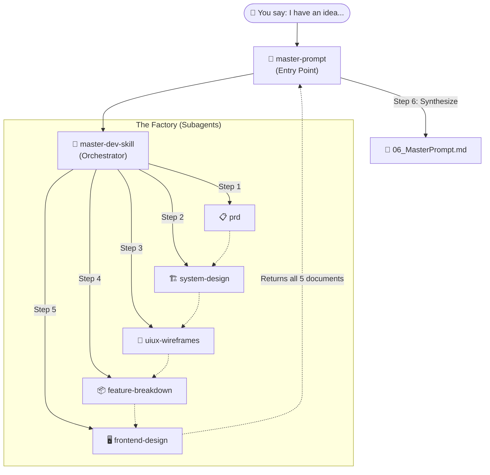

# 🚀 Claude Skills: The Master Dev Suite

Welcome to the **Master Dev Suite** — an absolute beast of an AI orchestration pipeline designed for Claude. This suite of 7 specialized skills works together autonomously to transform a single, raw product idea into a complete, professional, production-ready specification package and a code-ready Master Prompt.

Stop writing documentation by hand. Stop writing massive prompts from scratch. Drop your idea into Claude, and let the pipeline do the heavy lifting.

---

## 🧠 How It Works: The Architecture

The suite is built on a highly structured **Master Orchestrator** pattern. When you invoke the top-level skill, it acts as a manager, sequentially spawning dedicated subagents for each key area of software design before synthesizing everything at the end.



### The 7 Core Skills
1. **`master-prompt`**: The entry point. You talk to this skill. It triggers the pipeline and synthesizes the final prompt.
2. **`master-dev-skill`**: The factory floor manager. It handles the sequential execution of steps 1 through 5.
3. **`prd`**: Writes the Product Requirements Document (Goals, Scope, Target Audience).
4. **`system-design`**: Drafts the Technical Architecture, API endpoints, schema, and security flows.
5. **`uiux-wireframes`**: Creates the User Flows, Screen Layouts, and Navigation Maps.
6. **`feature-breakdown`**: Builds a granular Feature Tree and Sprint Tasks.
7. **`frontend-design`**: Establishes the Design System, Tokens, Components, and Accessibility needs.

---

## 🛠️ Installation

Installing these skills into your Claude Desktop application is straight-forward.

1. **Locate your Claude Skills Directory**
   Ensure you know where Claude is configured to look for custom skills.
2. **Copy the Suite**
   Copy all 7 folders (`master-prompt`, `master-dev-skill`, `prd`, `system-design`, `uiux-wireframes`, `feature-breakdown`, `frontend-design`) directly into your active Claude Skills directory.
3. **Keep the Folders Flat**
   Ensure the directory structure looks exactly like this. Claude needs to be able to find `/master-dev-skill/SKILL.md` relative to the skills root.
   ```text
   Claude Skills/
   ├── feature-breakdown/SKILL.md
   ├── frontend-design/SKILL.md
   ├── master-dev-skill/SKILL.md
   ├── master-prompt/SKILL.md
   ├── prd/SKILL.md
   ├── system-design/SKILL.md
   └── uiux-wireframes/SKILL.md
   ```
4. **Restart Claude**
   If Claude is currently running, quit and restart it so it indexes the new skills.

---

## ⚡ How to Call the Pipeline

Once installed, triggering the entire autonomous pipeline is as simple as talking to Claude. 

**Trigger Phrases to use:**
- *"Run the full pipeline. I have an idea for..."*
- *"spec out my idea"*
- *"turn my idea into a plan"*
- *"create a master prompt doc"*

### The Perfect Initial Prompt

To give the pipeline the best possible start, structure your first message like this (the `master-prompt` skill will extract this):

> **You:** "I want to run the full master dev pipeline. I have an idea for a SaaS tool called **MetricsFlow**. 
> - **Idea:** A dashboard that connects to Stripe and GitHub to show daily recurring revenue vs dev velocity. 
> - **Target User:** Solo founders and small dev teams. 
> - **Platform:** Web app. 
> - **Tech Stack:** Next.js, Tailwind, Supabase. 
> - **Scope:** I just want the MVP showing MRR and basic commit activity."

**What happens next?**
Sit back and relax. Claude will acknowledge your request, lock in the "Shared Context," and begin spawning the subagents. You will see progress updates (e.g., *🔄 Spawning PRD subagent...*) as it autonomously moves through the 6 stages. It will not pause to ask you questions between steps.

---

## 📦 The Aftermath: Handling the Output

Once the final synthesis is complete, Claude will present you with **6 incredibly detailed Markdown files**.

Here is exactly what to do with them:

| File | What it is | How to use it |
|------|-----------|---------------|
| `01_PRD.md` | Product Requirements | Read this first. Ensure Claude perfectly understood your scope and your target audience. Use it to align stakeholders. |
| `02_SystemDesign.md` | Architecture & Tech | Hand off to backend developers, or use it to confidently set up your initial database schemas and API scaffolding. |
| `03_UIUXWireframes.md` | Layouts & Flows | Forward to your UI/UX designer, or use it to structure your React/HTML page skeletons. |
| `04_FeatureBreakdown.md` | Task Backlog | Copy-paste this directly into Jira, Linear, or Trello to populate your immediate sprint backlog. |
| `05_FrontendDesign.md` | Design System | Keep this open when styling. It contains the exact Tailwind/CSS tokens and component standards you must adhere to. |
| `06_MasterPrompt.md` | **The Crown Jewel** | **This is your code-ready prompt.** |

### 🚀 Activating the Master Prompt

The `06_MasterPrompt.md` file is specifically engineered to be fed directly into an AI coding assistant (like Cursor, Claude Code, or GitHub Copilot).

1. Open your code editor (e.g., Cursor) or your terminal (Claude Code).
2. Attach or paste the **entire contents** of `06_MasterPrompt.md` into the AI's context.
3. Tell the AI: *"Read this Master Prompt document. Configure the initial boilerplate and begin executing the first feature from the priority list."*

Because the Master Prompt contains synthesized knowledge of the architecture, strict coding rules, design tokens, and feature priorities, the AI will immediately begin generating production-grade, architecturally sound code without needing hand-holding.

---

## ⚠️ Troubleshooting & Fallbacks

- **File not found errors:** Ensure folder names exactly match (`uiux-wireframes`, not `uiux`).
- **Circular dependencies:** The orchestration was carefully wired. Do not modify the subagent invocation flow inside `master-dev-skill` or `master-prompt`.
- **Direct Sub-Skill invocation:** You *can* call a sub-skill directly (e.g., "Write me a PRD"). However, the true power of this suite comes from using `master-prompt` to chain them together.

Enjoy building at lightspeed! 🚀
